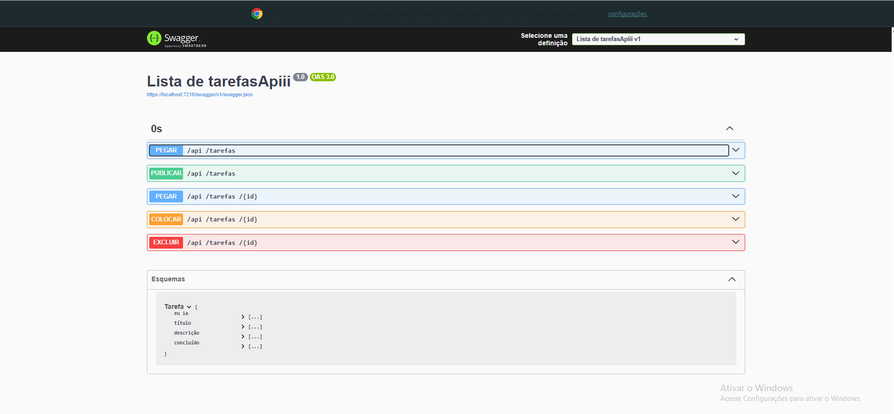

 # ✅ Todo List API

API RESTful desenvolvida com ASP.NET Core 8, Entity Framework Core e SQL Server para gerenciamento de tarefas (To Do List).

## 📌 Sobre o projeto

A aplicação permite realizar operações CRUD completas em uma lista de tarefas:

- Criar tarefas
- Listar tarefas
- Buscar tarefa por ID
- Atualizar tarefas
- Remover tarefas

---

# 🚀 Tecnologias utilizadas

- ASP.NET Core 8
- C#
- Entity Framework Core
- SQL Server
- Swagger / OpenAPI
- REST API

---

# 📁 Estrutura do projeto

```bash
Controllers/
Models/
Data/
Migrations/
Program.cs
appsettings.json
```

---

# 📂 Explicação das pastas

## 📁 Controllers/

Responsável por receber as requisições HTTP da API.

Nesta pasta ficam os endpoints da aplicação, como:

- GET
- POST
- PUT
- DELETE

Os Controllers fazem a comunicação entre o cliente e o banco de dados.

Exemplo:

```bash
GET /api/tarefas
POST /api/tarefas
```

---

## 📁 Models/

Contém as classes que representam as entidades da aplicação.

As Models definem como os dados serão armazenados no banco.

Exemplo:

```csharp
public class Tarefa
{
    public int Id { get; set; }

    public string Titulo { get; set; }

    public string Descricao { get; set; }

    public bool Concluida { get; set; }
}
```

Essa classe representa a tabela de tarefas no banco de dados.

---

## 📁 Data/

Responsável pela configuração do banco de dados.

Nesta pasta fica o:

```csharp
AppDbContext
```

O DbContext realiza a comunicação entre a aplicação e o SQL Server utilizando Entity Framework Core.

Também é responsável pelo mapeamento das tabelas.

---

## 📁 Migrations/

Contém os arquivos de migração do Entity Framework Core.

As migrations servem para:

- Criar tabelas
- Atualizar tabelas
- Alterar colunas
- Versionar o banco de dados

Comandos utilizados:

```bash
Add-Migration InitialCreate

Update-Database
```

---

## 📄 Program.cs

Arquivo principal da aplicação.

Responsável por:

- Configurar serviços
- Configurar Swagger
- Configurar Entity Framework
- Inicializar a API

Exemplo:

```csharp
builder.Services.AddControllers();

builder.Services.AddSwaggerGen();

builder.Services.AddDbContext<AppDbContext>();
```

---

## ⚙️ appsettings.json

Arquivo de configurações da aplicação.

Nele ficam:

- String de conexão
- Configurações do ambiente
- Configurações da aplicação

Exemplo:

```json
"ConnectionStrings": {
  "DefaultConnection": "Server=localhost\\SQLEXPRESS;Database=TodoListDb;Trusted_Connection=True;TrustServerCertificate=True;"
}
```

---

# ⚙️ Configuração do ambiente

## ✅ Pré-requisitos

Antes de executar o projeto é necessário possuir instalado:

- .NET 8 SDK
- SQL Server
- Visual Studio 2022

---

# 🔧 Configuração do banco de dados

A string de conexão está localizada em:

```bash
appsettings.json
```

Exemplo:

```json
"ConnectionStrings": {
  "DefaultConnection": "Server=localhost\\SQLEXPRESS;Database=TodoListDb;Trusted_Connection=True;TrustServerCertificate=True;"
}
```

---

# ▶️ Como executar o projeto

## 1. Clone o repositório

```bash
git clone https://github.com/Felippe-gif/TodoListApiii.git
```

---

## 2. Abra o projeto no Visual Studio

Abra a solução:

```bash
TodoListApiii.sln
```

---

## 3. Execute as migrations

Abra o Package Manager Console:

```bash
Tools → NuGet Package Manager → Package Manager Console
```

Execute:

```bash
Add-Migration InitialCreate
```

Depois:

```bash
Update-Database
```

---

## 4. Execute a aplicação

Pressione:

```bash
F5
```

ou:

```bash
Ctrl + F5
```

---

# 📘 Swagger

Ao executar a aplicação, o Swagger será aberto automaticamente.

Exemplo:

```bash
https://localhost:xxxx/swagger
```

---

# 📌 Endpoints da API

## ✅ Listar tarefas

```http
GET /api/tarefas
```

---

## ✅ Buscar tarefa por ID

```http
GET /api/tarefas/{id}
```

---

## ✅ Criar tarefa

```http
POST /api/tarefas
```

### Exemplo JSON

```json
{
  "titulo": "Estudar ASP.NET Core",
  "descricao": "Aprender CRUD com Entity Framework",
  "concluida": false
}
```

---

## ✅ Atualizar tarefa

```http
PUT /api/tarefas/{id}
```

### Exemplo JSON

```json
{
  "id": 1,
  "titulo": "Projeto atualizado",
  "descricao": "CRUD funcionando",
  "concluida": true
}
```

---

## ✅ Remover tarefa

```http
DELETE /api/tarefas/{id}
```

---

# 🛠️ Funcionalidades implementadas

- CRUD completo
- Entity Framework Core
- SQL Server
- Migrations
- Swagger/OpenAPI
- API RESTful

---

# 📘 Swagger

## Interface da API funcionando



---

# 👨‍💻 Autor

Felippe

GitHub:
https://github.com/Felippe-gif
